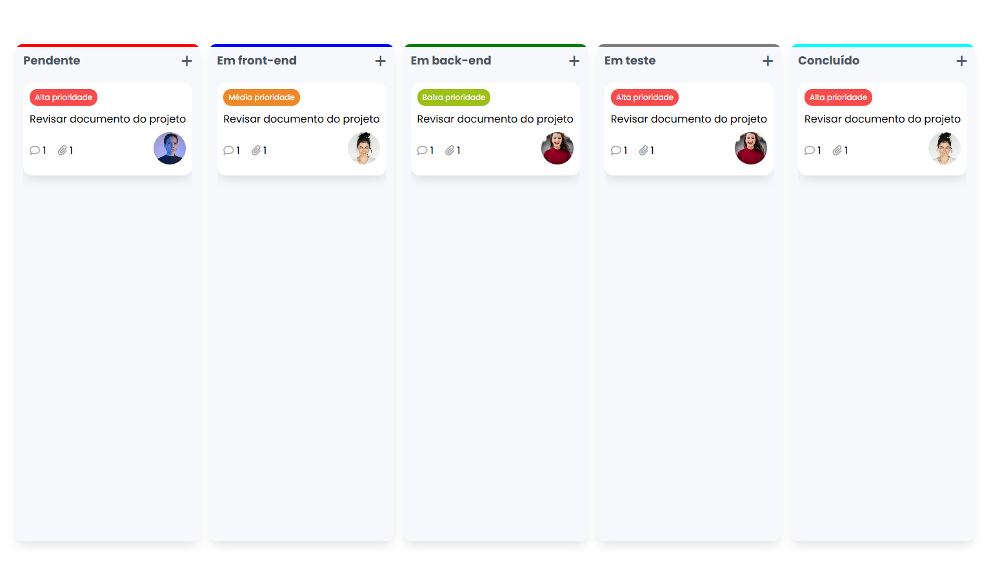

# Kanban

O Projeto Kanban foi desenvolvido com base nas aulas ministradas por Larissa Kich, trazendo uma abordagem prática e eficiente para a organização de tarefas e otimização de processos.

## Tecnologias utilizada
HTML, CSS e JavaScript

## Screenshot

